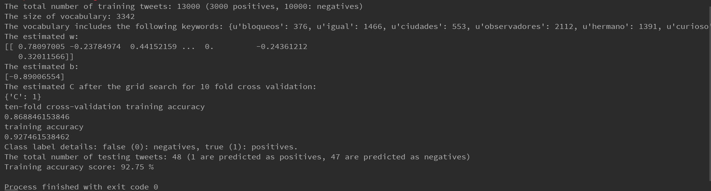

# Classification of civil unrest relevant tweets in the Mexico region

## Background
Event analysis of the form considered here is an established concept in social science research. Civil
unrest is a large concept intended to capture the myriad ways in which people express their protest against
things that affect their lives and for which they assume that the government (local, regional or national) has
a responsibility (e.g., cost of urban transportation, poor infrastructure, etc.). If the action is directed against
private actors, there is normally a connection to government policy or behavior, e.g., a labor strike against a
private company can disrupt the rhythm of everyday life for the rest of society, turn violent or lead to a series
of disruptive strikes which require government involvement, and thus responsibility in the eyes of citizens.
Civil unrest does not include acts by criminals for purely private gain. While authoritarian governments
may outlaw civil protest and thus ‘criminalize’ the participants, social scientists would distinguish illegal
political protests from illegal criminal activities. Gang members stopping public buses to extort payoffs from
bus owners would not be a civil unrest event, though people protesting afterward against the government’s
inability to control such gangs would be considered civil unrest.

This expansive definition of civil unrest means that one can find it everywhere, including European
protests against austerity or marches against an oil pipeline from Canada across the US to the Gulf of
Mexico. Latin America, nevertheless, offers some special characteristics that make it an excellent region
for study in our project. The region experiences a plethora of civil unrest events every day (providing a
sufficient number of GSR events to train machine learning models), is well covered by international and
national news media (facilitating the task of generating ground truth), is the object of detailed empirical
research and polling (permitting the description of the social, political and economic context within which
civil unrest occurs) and has a significant and growing number of social network users (thus supporting the
use of modern data mining algorithms).

Read the article "Beating the news with EMBERS- Forecasting Civil Unrest using Open Source Indicator.pdf" for more details

## Installation
```
Python v2.7.14
```

Use the package manager [pip](https://pip.pypa.io/en/stable/) to install packages.

```bash
pip install scikit-learn  #v0.21.2
pip install numpy         #v1.14.2
```

## File Description


1. train_posi_tweets_2007.txt 
(4000 positive tweets) 

2. train_nega_tweets_2007.txt
(8000 negative tweets)

3. unlabeled_tweetss_2007.txt
(51647 unlabeled tweets)


* Note: These unlabeled tweets are provided in case you want to try some unsupervised techniques (e.g., clustering) to generate your classifier.


## Tweet Format

tweet = {"lang": "es", "city": "Puebla", "embersId": "90ec51abad3f32705b511f5d0cd58b49d11ac40c", "uid": 152810236, "Parent_embersId": "7f208b7f82b8f29ad2349779e774f419f2915ea4", "derivedFrom": "1e1d43c10095a980e0746ace31e4f946", "instantloc": {"city": [["heroica puebla de zaragoza", [-98.22, 19.05], 1467419]], "state": []}, "key_count": 2, "score": 0.0013994149053899736, "text": "\u201c@mlucascir: RT \u201c@mauolmedo: La marcha anti pe\u00f1a en #Puebla  M\u00e9xico http://t.co/CXRjG59d\u201d...buena marcha gente de Puebla.", "date": "2012-07-22 20:30:23", "country": "Mexico", "text_items": [["rt", "march", "gent", "pen", "anti", "puebl", "mexic"], ["#puebla"], ["@mlucascir", "@mauolmedo"], ["http://t.co/cxrjg59d\u201d...buena"]], "screen_name": "DUEMIKE"}


The above is an example tweet. The following are the basic items

```tweet['embersId'] == tweet id. 
tweet['text'] == tweet text.
tweet['text_items'][0] == list of stemmed terms of the tweet text. 
tweet['text_items'][1] == list of hashtags in the text. 
tweet['text_items'][2] == list of user mentions in the text. 
tweet['text_items'][3] == list of links in the text. 
```
## Output


## Overview

* A model is trained on the data provided in 'train_nega_tweets_2017.txt',  'train_posi_tweets_2017.txt' and formated it in to a simpler format and saved it in a 'training_tweets_2017.txt' file which was fed to creat X, and y.

* The trained classifier model is now saved and can be reused to perform classification task on the similar relavent tweets so that we don't have to train the model every time we perform a similar task.

* Model is saved by pickling it using pickle module.

* Pickling is the name of the serialization process in Python. By pickling, we can convert an object hierarchy to a binary format (usually not human readable) that can be stored. To pickle an object we just need to import the pickle module and call the dumps() function passing the object to be pickled as a parameter.

* Saved model then loaded by unpickling it.

* The process that takes a binary array and converts it to an object hierarchy is called unpickling. The unpickling process is done by using the load() function of the pickle module and returns a complete object hierarchy from a simple bytes array. 

* 'saved_model.py' file reads the model and saves the model as 'saved_model.pkl' file.

* 'predictions.txt' file contains class label for the given 'test_tweet.txt' file.

* All the '.py' files, '.txt' files, and '.pkl' file must be kept inside the same folder when execute the 'svm_model_classifier.py'.
